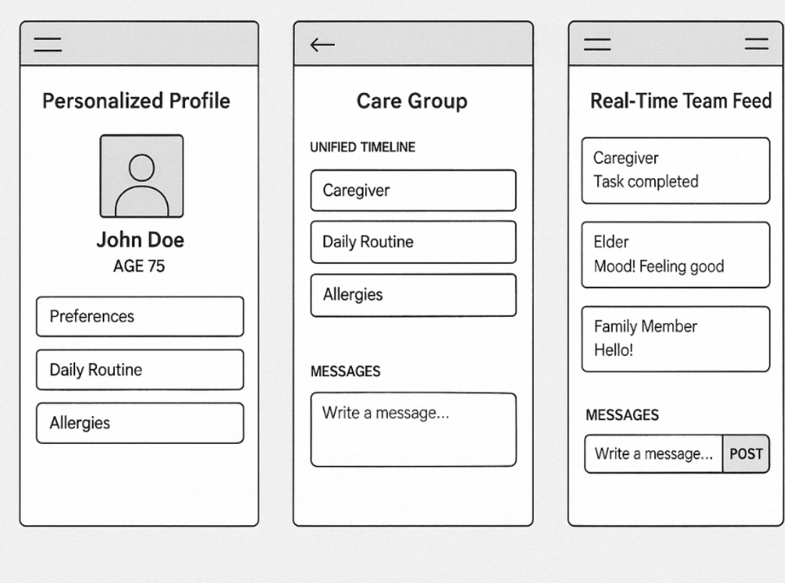
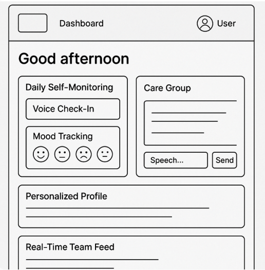
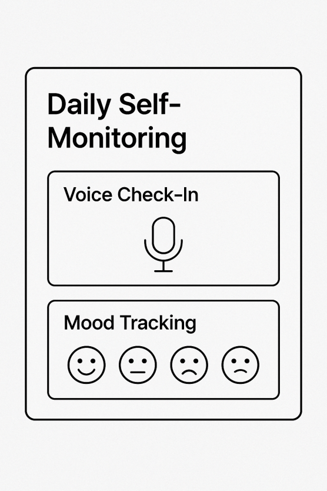

**Problem Statement**
Communication between elders, caregivers, and family members is frequently fragmented in home care settings. The elderly are often left out of decision-making in daily decisions and updates, family members are often disconnected from their loved ones’ care, and caregivers are often burdened with repetitive documentation of tasks while providing quality care. 

Through extensive research, help confirmed our case:

*   Elder autonomy is often compromised due to family over-involvement or caregiver overreach. Elders want to express their preferences but often aren’t given the tools to do so. [(NIH, PMC10946444)](https://pmc.ncbi.nlm.nih.gov/articles/PMC10946444/)
    
*   Caregivers struggle with inefficient logging—using binders, sticky notes, or informal texts—which leads to burnout and potential miscommunication. [(NIH, PMC8160020)](https://pmc.ncbi.nlm.nih.gov/articles/PMC8160020/)
    
*   Families feel out of the loop, especially if they live far away or can’t visit often. Without real-time updates or a shared source of truth, anxiety and misunderstandings rise.
    

Finding this issue propelled our team to dive deeper into existing solutions that have shown success. The current market has platforms(like Carely, Caring Village, and ianacare) that offer task tracking for caregiver and family updates, but there is a key issue that was never solved. The elders are hardly placed at the center, or was there a unified communication that created transparency.  Rarely was accessible concern present in the various platforms we researched. Thus, There’s a clear need for a simple, transparent, and elder-first platform that connects all parties with clarity and dignity.

**SWOT Analysis summary :** 

Platform

Strength

Weakness

Caring Village

Comprehensive features

Buggy, elderly voice limited

Carely

Simple family feed

No care tracking, elder not included

ianacare

Mobilizes support team

Doesn’t track elder health

CircleOf

Unified care timeline

No elder-friendly interface

CareMobi (Research)

Integrates with providers

Not for everyday family use

**Gaps in Existing Platforms:**

*   Elders are passive in most apps—others speak _for_ them.
    
*   Most interfaces are made for tech-savvy caregivers, not older adults with visual, cognitive, or dexterity challenges.
    
*   Information is fragmented across tools (medications here, visits there), causing confusion and redundancy.
    
*   Family communication is inconsistent, especially when roles aren’t clearly defined.
    

### What Works Well in Other Apps(features):

*   Shared calendars and timelines improve coordination (e.g. CircleOf, Caring Village)
    
*   Quick logging systems reduce documentation time (e.g. checklists in ianacare)
    
*   Push notifications help families stay informed without overloading them
    
*   Platforms that include emotional support (like community forums or kudos systems) improve caregiver morale
    

**Design Feature for CareCircle (Three different dashboards for elders, families and caregivers)**

1.  Elder-centered Design Features
    
    1.  Daily Self-Monitoring
        
        1.  Voice-Based Check-Ins: Integrate ElevenLabs LLM models to support daily self-assessment through in-app real-time conversation with customized AI assistants and families can check the recording. 
            
        2.  Mood Tracking Interface: Elders can select from predefined mood indicators or express custom notes via voice or text input.
            
    2.  Personalized Profile
        
        1.  Store preferences, daily routines, allergy history, chronic conditions…
            
    3.  Care Group (Built-In Messaging System)
        
        1.  Feedback modules embedded in care task updates, allowing elderly to express opinions or adjustments. (speech-to-text)
            
        2.  Inputs are logged and available for review by families and caregivers.
            
2.  Family Engagement & Communication
    
    1.  Real-Time Team Feed
        
        1.  Unified timeline
            
            1.  Care activity from caregivers
                
            2.  Conditions/Mood updates from elders 
                
            3.  Messages
                
        2.  Role-based content filtering.
            
    2.  Care Group (Built-In Messaging System)
        
        1.  Feedback modules embedded in care task updates, allowing families to express opinions or adjustments. 
            
3.  Caregiver Workflow
    
    1.  Multi-Elder Management Interface
        
        1.  Caregivers can access a centralized dashboard listing all assigned elders. Each entry includes: 
            
            1.  Name, photo, age
                
            2.  Current mood status
                
            3.  Health Precautions
                
            4.  …
                
    2.  Caregiver Report Generation Tool
        
    3.  Care Group (Built-In Messaging System)
        
        1.  Caregivers can mark tasks as “Completed” directly in the chat
            
        2.  Optionally prompted to upload a photo as proof of task completion (e.g., clean wound dressing, taken medication)
            
        3.  System-generated confirmations populate the thread (e.g., “✓ Medication given at 10:30 AM”)
            

**Design Direction**We want to create a platform that is more than just a task list, but a shared space between all stakeholders

*   Caregivers are not burned out 
    
*   Families are connect 
    
*   Everyone knows what's happening without the need for a phone call 
    
*   Elders have an active voice
    

With a clear timeline, intuitive UI, and role-based features, CareCircle can build trust and reduce stress, while truly centering the people who matter most.

**Wireframes**

We have created a few wireframes so far to visualize where we want our design to go.
The screenshot below shows our personalized profile, the care group, and real time feed

The screenshot below shows our dashboard.

The screenshot below shows what an error message would look like

The screenshot below shows our daily self monitoring screen

Work Cited

*   Budde, H., & Zeller, A. (2021). _Communication Between Home Care Workers, Clients, and Families: An Integrative Review_. Journal of Gerontological Nursing, 47(5), 7–15. https://doi.org/10.3928/00989134-20210412-01
    
*   Cohen, M. Z., & Hansel, J. (2021). _Ethical and Effective Communication With Older Adults_. Journal of Gerontological Nursing, 47(6), 9–14. https://doi.org/10.3928/00989134-20210511-01
    
*   National Institute on Aging. (2024). _Challenges in Caregiver-Family-Elder Communication_. U.S. Department of Health & Human Services. [https://pmc.ncbi.nlm.nih.gov/articles/PMC10946444/](https://pmc.ncbi.nlm.nih.gov/articles/PMC10946444/)
    
*   National Institutes of Health. (2021). _Improving Family Caregiver Communication in Home Health Settings_. [https://pmc.ncbi.nlm.nih.gov/articles/PMC8160020/](https://pmc.ncbi.nlm.nih.gov/articles/PMC8160020/)
    
*   Park, L. G., Beatty, A., Stafford, Z., & Lee, J. (2022). _Caregiver Mobile Applications: A Scoping Review to Identify Features and Gaps_. Journal of Medical Internet Research, 24(6), e36045. https://doi.org/10.2196/36045
    
*   World Wide Web Consortium (W3C). (2021). _Accessibility Requirements for People with Low Vision_. [https://www.w3.org/TR/low-vision-needs/](https://www.w3.org/TR/low-vision-needs/)
    
*   Farage, M. A., Miller, K. W., Ajayi, F., & Hutchins, D. (2012). _Design principles to accommodate older adults_. Global Journal of Health Science, 4(2), 2–25. https://doi.org/10.5539/gjhs.v4n2p2
    
*   Toptal Design Blog. (2023). _Accessible UX Design for Seniors: Best Practices_. https://www.toptal.com/designers/ux/accessibility-for-seniors
    
*   Caregiving.com. (2023). _Review of Top Elder Care Apps_. https://www.caregiving.com/articles/best-caregiver-apps/
    
*   Caring Village. (n.d.). _Caring Village App Overview and Features_. Retrieved from [https://www.caringvillage.com](https://www.caringvillage.com)
    

Carely. (n.d.). _Connecting Families Around Elder Care_. Retrieved from [https://www.carelyapp.com](https://www.carelyapp.com)

